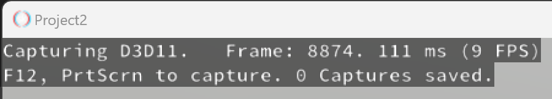
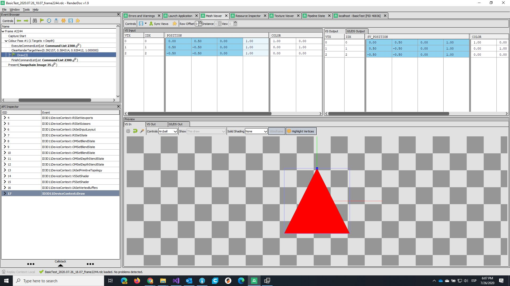
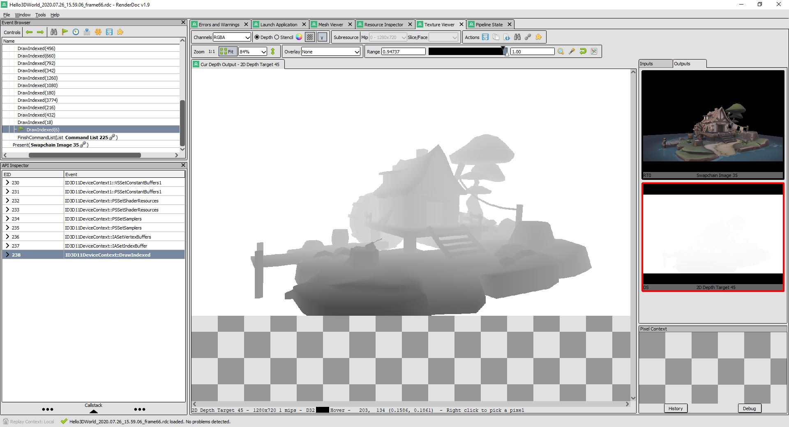

# RenderDoc.NET
This repository contains low-level bindings for RenderDoc used in Evergine for .NET Core and .NET 6.0.
This binding is auto-generated from renderdoc api header: https://github.com/baldurk/renderdoc/blob/v1.x/renderdoc/api/app/renderdoc_app.h

Official documentation: https://renderdoc.org/docs/in_application_api.html

[](https://github.com/EvergineTeam/RenderDoc.NET/actions/workflows/CD.yml)
[](https://www.nuget.org/packages/Evergine.Bindings.RenderDoc)

## Features

- RenderDoc 1.4.1
- Raw low level binding using unsafe c# code

## Installation
### Visual Studio
#### NuGet Package Manager
Create a C# project and open the NuGet package manager, select the Browse tab, search for Evergine.Bindings.RenderDoc and install the package.
#### Or via the Package Manager Console
```
dotnet add package Evergine.Bindings.RenderDoc
```

## Usage
- Make sure [RenderDoc](https://renderdoc.org/) is installed on your system. 
- Include the `Evergine.Bindings.RenderDoc` namespace in your code:
    ```csharp
    using Evergine.Bindings.RenderDoc;
    ```
- Load RenderDoc into your C# application before any rendering code happen, as early as possible:
    ```csharp
    RenderDoc.Load(out RenderDoc renderDoc);
    ```
- If you have a window based application you will get a RenderDoc overlay on the top left corner of your window. You can take a RenderDoc screenshot by pressing F12 or PrtScrn.

- Or if you do not have a window based application you can capture a frame by calling:
    ```csharp
    renderDoc.API.StartFrameCapture(IntPtr device, IntPtr wndHandle);
    ... graphics code ...
    renderDoc.API.EndFrameCapture(IntPtr device, IntPtr wndHandle);
    ```
- A RenderDoc capture file will be created in the default directory: `C:\Users\{user}\AppData\Local\Temp\RenderDoc`. You can double click that file and it will open in RenderDoc.
## Test Images




## Related Work

- [Veldrid RenderDoc Binding](https://github.com/mellinoe/veldrid/tree/c44982e59b0a77a3e01ece926e9993dc72986b0d/src/Veldrid.RenderDoc)
